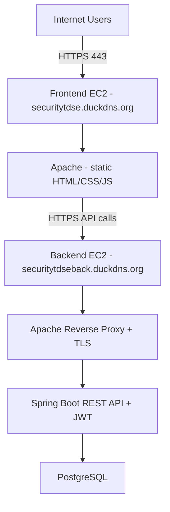
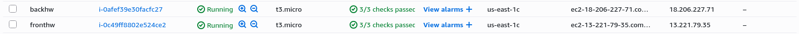
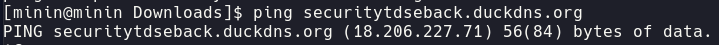
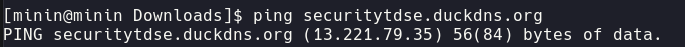
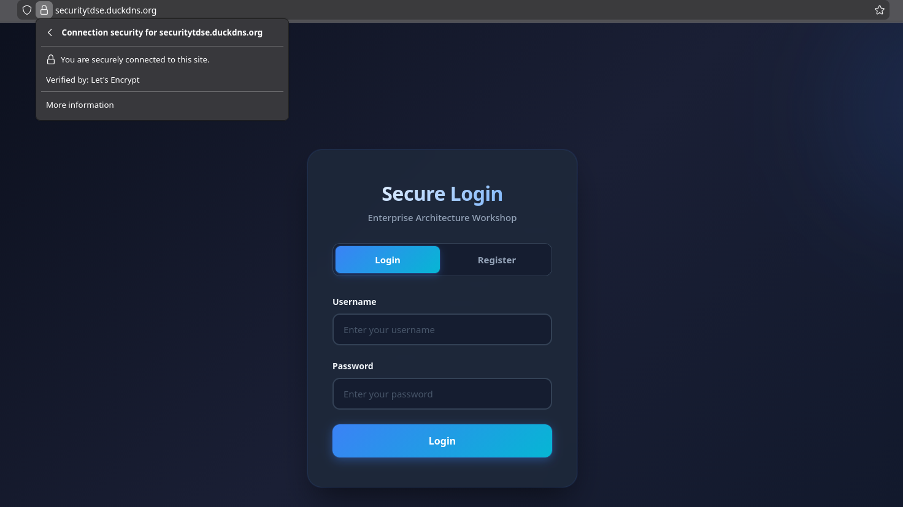
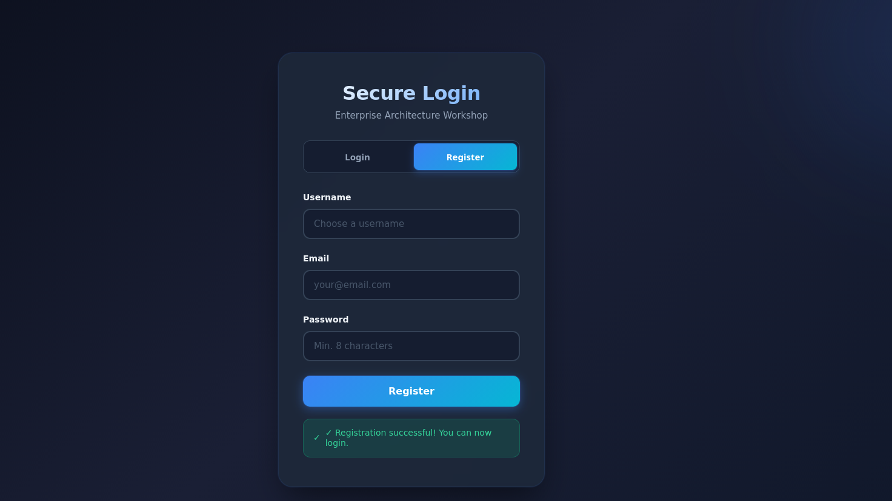
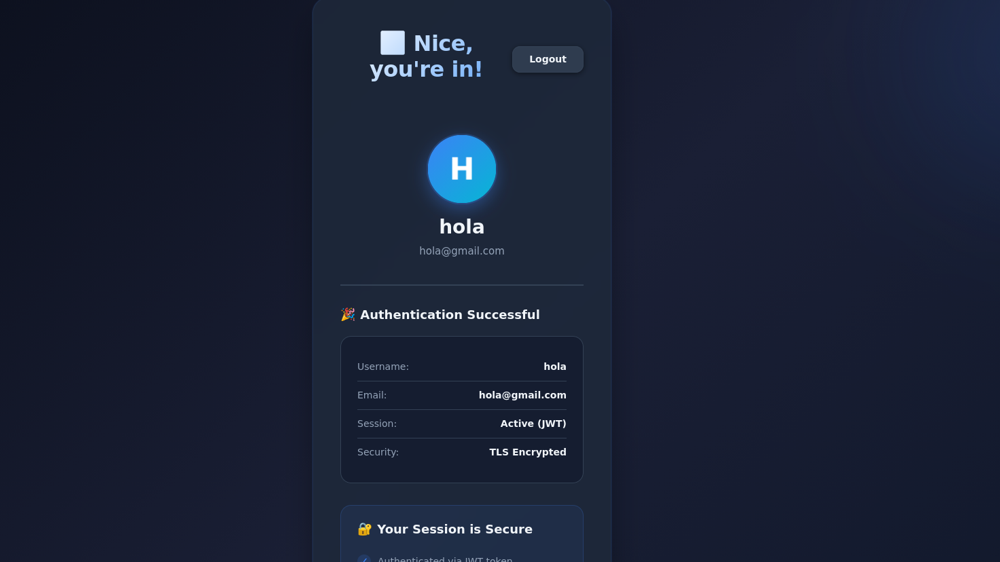
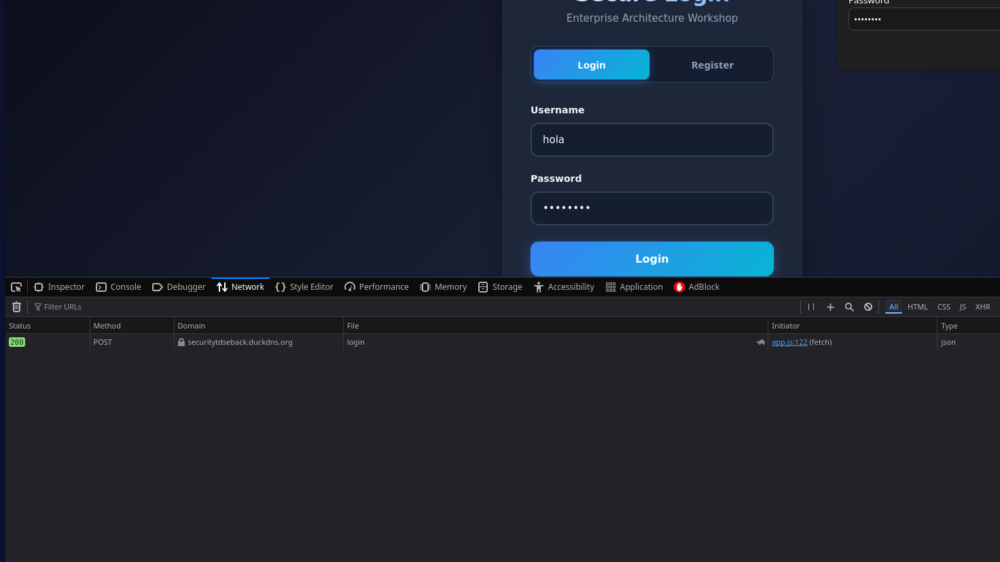
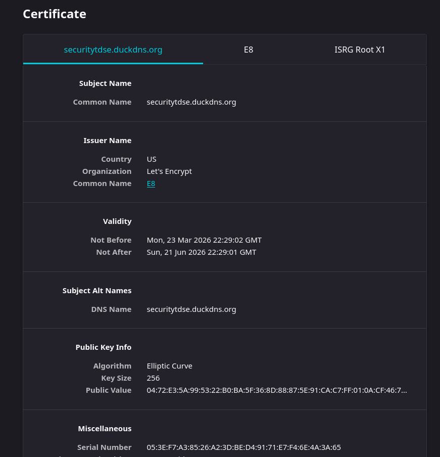

# AWS_Login_Service-TDSE

[](https://github.com/juancontrerasp/AWS_Login_Service-TDSE/actions/workflows/threat-modeling.yml)
[](https://github.com/juancontrerasp/AWS_Login_Service-TDSE/actions/workflows/security-check.yml)

## Juan Pablo Contreras Parra

---

Secure AWS login service with a separate frontend and backend, deployed with HTTPS.

### 🛡️ Automated Threat Modeling

This repository includes automated security testing via GitHub Actions. See [Threat Modeling Documentation](.github/THREAT_MODELING.md) for details.

This GitHub repository contains all source code and a **self-contained README** with deployment, architecture, testing evidence placeholders, and demo video placeholder for workshop submission.

## Repository Contents

- `back/` - Spring Boot backend (JWT auth, PostgreSQL, Apache reverse proxy)
- `front/` - HTML/CSS/JavaScript frontend served by Apache
- `README.md` - Main document with full deployment and architecture content

## Deployment Instructions

### Prerequisites

- 2 AWS EC2 instances (Amazon Linux preferred): one for frontend, one for backend
- Security Group inbound rules: `22`, `80`, `443`
- Domains pointed to EC2 public IPs (in this case):
  - Frontend: `securitytdse.duckdns.org`
  - Backend: `securitytdseback.duckdns.org`
- SSH key for both instances

### 1) Deploy Backend (EC2 for API)

```bash
ssh -i your-key.pem ec2-user@BACKEND_EC2_IP
git clone https://github.com/juancontrerasp/AWS_Login_Service-TDSE.git
cd AWS_Login_Service-TDSE/back
docker compose up -d --build
docker compose ps
```


### 2) Deploy Frontend (EC2 for Web)

```bash
ssh -i your-key.pem ec2-user@FRONTEND_EC2_IP
git clone https://github.com/YOUR_USERNAME/AWS_Login_Service-TDSE.git
cd AWS_Login_Service-TDSE/front
chmod +x deploy.sh
./deploy.sh
docker compose ps
```

### 3) Verify Endpoints

```bash
# Frontend
curl -I https://securitytdse.duckdns.org

# Backend health/auth endpoint (example)
curl -I https://securitytdseback.duckdns.org/api/auth/me
```

### 4) Functional Test Flow

1. Open `https://securitytdse.duckdns.org`
2. Register a new user
3. Login with that user
4. Access dashboard
5. Trigger authenticated endpoint (`/api/auth/me`)
6. Confirm no CORS errors in DevTools
7. Confirm HTTPS lock icon and valid certificate

## Architecture Overview



### Architecture Notes

- Frontend and backend run on separate EC2 instances.
- HTTPS/TLS is enabled on both domains (Let's Encrypt).
- Backend uses JWT authentication and BCrypt password hashing.
- PostgreSQL is used for user persistence.

## Testing Evidence

Add your screenshots below before submission.

### 1) AWS Infrastructure Running



### 2) IP Matching





### 3) Frontend Over HTTPS



### 4) User Registration Success



### 5) User Login Success




### 6) DevTools Network



### 7) TLS Certificate Details



## 🎥 Very Important: Demo Video Placeholder (HTTPS + Full Flow)

**Video link:**  

https://www.youtube.com/watch?v=Az_z21saz6E


## Security Highlights

- TLS/HTTPS on frontend and backend
- HTTP to HTTPS redirection
- JWT-based authentication
- BCrypt password hashing
- Security headers and controlled CORS
- **🛡️ Automated threat modeling** with attack simulation
- Continuous security testing in CI/CD pipeline

## Threat Modeling & Security Testing

This repository uses automated threat modeling to continuously test for vulnerabilities:

- **Attack Simulations**: SQL Injection, Brute Force, Information Leakage
- **Automated Runs**: On every push, PR, and weekly schedules
- **Interactive Reports**: JSON results and HTML dashboard
- **PR Comments**: Automatic vulnerability summaries on pull requests

📚 **[View Full Threat Modeling Documentation](.github/THREAT_MODELING.md)**

### Quick Start

Run threat modeling locally:
```bash
# Start the login service
cd back
mvn spring-boot:run

# In another terminal, run attack simulation
cd /path/to/Attack-Simulation-FDSI
./launch_attack.sh http://localhost:8080
```

View results in the interactive dashboard or check `results.json` for details.

